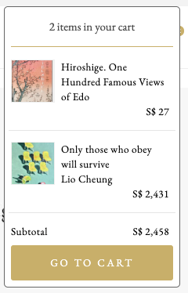

# The Artling Frontend Developer Assignment

Hi there! We are excited to hear that you would like to join the software
development team at The Artling.

We have created a little assignment for you to assess your current skill level.

In order to complete this assignment, please do the following things:

1. fork this repository into your own Github account
1. clone your fork into your own computer
1. follow the instructions for each of the three tasks carefully
1. whenever you are done with a task, make a commit with your changes
1. when you are done with all tasks, push your local repo and send us an email
   with a link to your fork.

We do not care how long you take to complete this assignment. You may of course
use Google for help. If you have any questions or you feel stuck, you may
message us as any time.

All tasks in this assignment are actual tasks that we had to implement in the
past for theartling.com, so we hope that this assignment gives you a good idea
of how work at The Artling feels like.

Ready? Let's go!

## Task #1: A Cart Popup

This task will test your HTML & CSS skills and very basic React skills.

Here is your task: Please have a look at theartling.com and add two artworks
to the shopping cart. Then click at the cart icon at the top right. You should
see something like this:

We would like you to start the dummy app in this repo and make sure that the
cart icon of that dummt app looks as close as possible to the original at
theartling.com.

To start the dummy app, please clone your fork of this repo to your disk, then
`cd` into the folder `dummy-app` and run `yarn` (install yarn if you don't have
that yet).

After all dependencies have been installed, you can run `yarn start` and the
site should show up in your browser at `localhost:3000`.

Here are some tips to get you up to speed:

1. First, make sure that the round badge with the number looks like the original
   one.
1. Then make sure that the badge is moved to the top right of the cart icon.
1. Now pass `isVisible={true}` into the `<Popover>` component so that it is
   always open, this makes it easier to create the styles for the component.
   Otherwise you would have to click at the cart icon every time you make a
   little change in the code.
1. Add border styles and padding to the popover, maybe also a fixed width.
1. Remove the dummy text and in it's place, make sure to render the two
   <CartItem> components and style them. Note that the `DUMMY_DATA` array
   contains two items, so you should display that data.
1. Add the little heading, the subtotal and the button in the popover. Can
   some of these be new components? Feel free to create new files and folders
   if you like.
1. So far, the popover sticks to the bottom of the cart icon. Can you move it
   up so that it aligns with the top of the cart icon?
1. Can you replicate little details like hover effects and cursor styles?

Here are some things you need to worry about:

1. We would like to see clean HTML and CSS.
1. You will see that we are using `emotion` to style our components. As a rule
   of thump, if you only want to add one or two css styles, you may just use
   the `style={{...}}` prop on the `
`, but if you need to add more styles
   create a `const Whatever = styled.div(props => ({...}))` component. You can
   find many examples of this in this codebase. If you have trouble
   understanding emotion, look at the codebase and play around with the styled
   components that we already have and read the emotion documentation. If you
   are still stuck, let us know!
1. You will need attention to detail. We would like your solution to look as
   close as possible to the original.

Here are some things you don't need to worry about:

1. Don't worry about the font too much. You can use `"EB Garamond", serif` as
   the font for the text in the cart popup.
1. Don't worry about different styles for different screen sizes (mobile
   responsive styles). The cart popup is so small, you can assume that it will
   look exactly the same on mobile devices. So you don't need to use
   react-grid-system for the cart popup content.
1. Don't worry about the animations.

## Task #2: What Language Is In The URL?

This task will test your string manipulation skills. At theartling.com, all our
URLs start with either `/en/` (for English) or with `/zh-cn/` (for Chinese).

Most of our components need to know what the current language is, so we built
a little function called `getCurrentLocale`. That function takes any URL as
a string and returns either `en` or `zh-cn` as a string. The function needs to
be resilient, so if a URL does not have any language or if the language is
not at the beginning of the URL, then we just assume that someone messed with
the URL in the browser and we return `en` as the default language.

Can you implement a function like this?

Here are some tips to get you started:

1. Run `yarn test`. You will see a lot of errors, so first, let's make sure that
   you only see the errors relevant for this task. Press `p` and then type `i18n`.
   Now `yarn test` will only look for tests in the file `utils/i18n.test.js`.
1. Have a look at that file! The test cases describe quite nicely what the function
   is supposed to do. Of course, all tests currently fail, because the actual
   function in the file `utils/i18n.js` currently just returns `undefined`.
1. Only work in `i18n.js`, do not change the tests!

Can you make sure that all tests pass? Good luck!

## Task #3: A Pagination Algorithm

This task will test your logical skills. This one is going to be tricky but we
can't wait to see what solution you will come up with. :)

Have a look at `theartling.com/en/art/` and scroll down until you see the
paginator. Press next a few times and see how the paginator changes. You will
see that the paginator always shows a window of five pages, with the current
page being in the center. Only for the first two pages and the last two pages
the current page is not quite in the center.

We would like you to build a function called `paginator()`. The function takes
two arguments as integers: The `currentPage` and the `totalPages`. It shall
return an array of numbers, which resemble the five numbers that we would want
to render for the paginator.

Examples:

- If we call `paginator(1, 20)` it should return `[1, 2, 3, 4, 5]`
- If we call `paginator(8, 20)` it should return `[6, 7, 8, 9, 10]`
- If we call `paginator(19, 20)` it should return `[16, 17, 18, 19, 20]`

As before, you can run `yarn test`, then press `p` and type `pagination`. You
can have a look at `utils/pagination.test.js` to find out more about the task,
but just like before, you may not make changes to the tests.

You can implement your solution in `utils/pagination.js`. Make sure that all
tests pass. Good luck!
